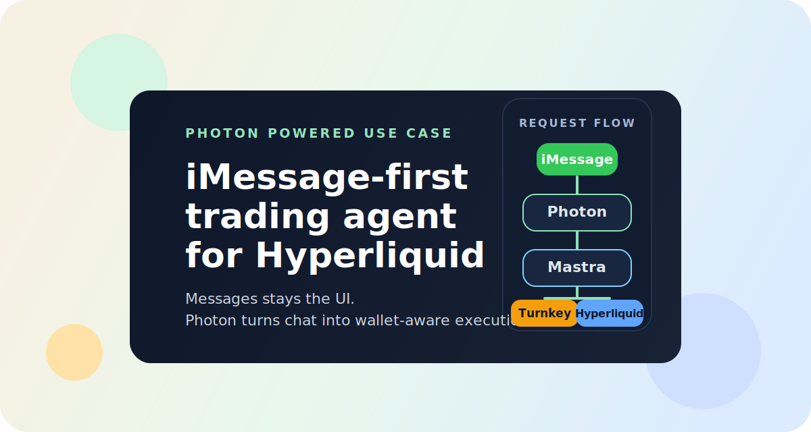
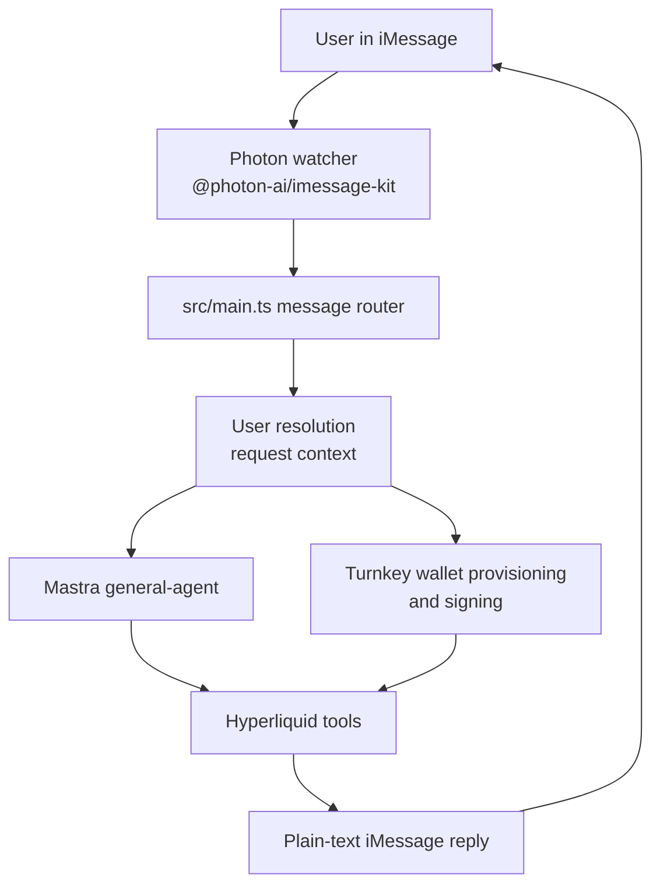

<div align="center">



# imessage-financial-assistant

**Photon-powered iMessage use case for a Hyperliquid trading agent.**

[](https://github.com/posaune0423/imessage-financial-assistant/actions/workflows/ci.yml)
[](https://github.com/photon-hq/imessage-kit)
[](https://mastra.ai)
[](https://www.turnkey.com/)
[](https://hyperliquid.xyz/)

[Photon iMessage Kit](https://github.com/photon-hq/imessage-kit) · [PRD](./docs/PRD.md) · [TECH](./docs/TECH.md) · [STRUCTURE](./docs/STRUCTURE.md)

</div>

## What This Product Is

This repo is an `iMessage -> Photon -> agent -> wallet -> Hyperliquid` product.

- The user talks in iMessage.
- `@photon-ai/imessage-kit` turns that chat into app events on macOS.
- A Mastra agent resolves intent, reads account state, and prepares actions.
- Turnkey handles wallet provisioning and signing.
- Hyperliquid is the trading venue.

The result is a chat-native trading workflow without building a separate frontend.

## Why This Is a Good Photon Use Case

This is not a generic bot template. It is a concrete Photon use case that shows how to build an iMessage-native product with real wallet and trading state behind it.

- iMessage is the primary UI, not a notification side channel.
- Photon is the transport boundary that makes the local Messages runtime usable from app code.
- The app can reply with portfolio data, market context, and confirmation-gated trading actions in the same conversation.

## Main Use Cases

- Check wallet-backed account state from iMessage
- Read Hyperliquid market snapshots, open orders, and recent fills
- Place, cancel, modify, or update leverage with an explicit confirmation code

## Architecture



Signed trading actions stay confirmation-gated: the agent returns a deterministic code first, and execution only happens after that exact code comes back through iMessage.

## Quick Start

```bash
bun install
cp .env.example .env
bun run dev
```

You need macOS, Messages access for Photon, an OpenAI API key, and Turnkey server credentials. For the full environment contract and implementation details, see [docs/TECH.md](./docs/TECH.md).

## Development

```bash
vp check
```
