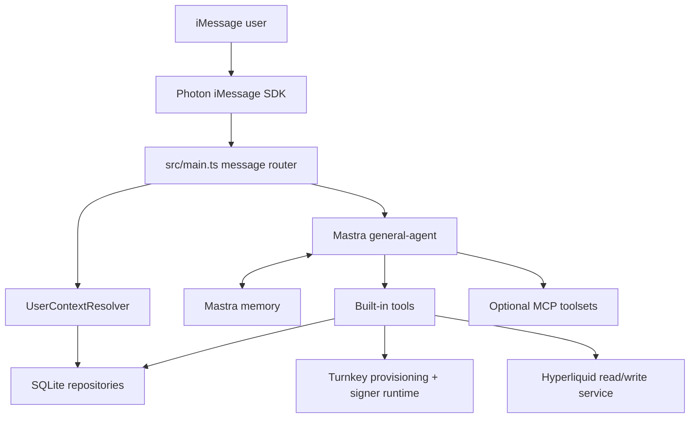

# DESIGN — iMessage-First Hyperliquid Trading Agent

**Version**: 2.0  
**Date**: 2026-04-13

## Design Goals

- Let a user interact with Hyperliquid through plain-text iMessage
- Hide wallet provisioning complexity behind a stable user layer
- Keep one agent runtime while still supporting multiple users
- Execute signed Hyperliquid actions directly once the agent has resolved the request
- Keep the app DB as the source of truth for user and wallet state

## System Topology

## Request Lifecycle

### 1. Inbound transport

- Photon watches the local macOS Messages runtime.
- `src/main.ts` receives direct messages and ignores reactions.
- Replies prefer `chatId` when available because it is the most stable reply target.

### 2. User resolution

- `UserContextResolver` maps the normalized `sender` identity to a stable user and keeps `chatId` only for reply routing.
- The app persists sender identities and generates a stable `resourceKey`.
- Mastra memory is keyed by that `resourceKey`, not by raw phone formatting.

### 3. Wallet readiness

- Before agent execution, the app checks whether the user already has a primary wallet.
- If not, `TurnkeyProvisioningService` provisions or reuses the Turnkey linkage and stores it in the wallet repository.
- Wallet readiness and signer readiness are persisted in the DB.

### 4. Agent execution

- The request context includes user and wallet metadata.
- The agent runs with built-in web, iMessage, wallet, and Hyperliquid tools.
- MCP toolsets are resolved only for likely wallet / onchain / crypto-heavy queries.

### 5. Response

- Tool steps are logged during execution.
- A progress reply can be sent once when the agent starts calling meaningful tools.
- The final user-facing reply stays iMessage-safe: no structural Markdown, no Markdown text effects, and purposeful emoji plus line breaks should carry most of the scanability. Copyable identifiers should remain easy to copy.

## Wallet and Trading Design

### App-user model

The app separates messaging identity from wallet identity:

- messaging inputs can vary in formatting
- users stay stable
- the wallet repository stores the current primary wallet for that user

This is the foundation that lets one Mastra agent handle many users safely.

### Turnkey role

Turnkey is responsible for:

- wallet provisioning
- sub-organization / account linkage lookup
- signer readiness
- producing the signing runtime used by the Hyperliquid adapter

The app requires Turnkey server credentials at startup. The current branch treats Turnkey as mandatory infrastructure rather than an optional add-on.

### Hyperliquid role

Hyperliquid is responsible for:

- market snapshot reads
- account summary reads
- open-order reads
- fill reads
- signed trading actions

The Hyperliquid service sits behind `src/lib/hyperliquid/service.ts`, so agent tools do not need to know SDK construction details.

### Direct writes

All signed Hyperliquid actions follow the same shape:

1. the tool resolves the Turnkey-backed signer for the current user
2. the first tool call returns an exact confirmation code for the requested action
3. the tool submits the Hyperliquid action only after the user replies with that exact code
4. the assistant reports the resulting success or failure directly in iMessage

The safety boundary lives in both Turnkey signer configuration and the app-enforced confirmation-code gate for signed writes.

## Tool Surface

Current built-in tool families:

- web tools
- iMessage send / read tools
- scheduling and reminders
- wallet status / provisioning tools
- Hyperliquid read / write tools

The agent prompt explicitly instructs the model to trust tool outputs over conversation memory for wallet state, positions, fills, and orders.

## Persistence Model

SQLite is the app-owned source of truth for:

- users
- messaging identities
- primary wallet linkage and status

Mastra memory stores conversational state, but not authoritative wallet state.

## Operational Constraints

- iMessage responses must stay iMessage-safe: avoid structural Markdown, avoid Markdown text effects, use emoji and line breaks for lightweight visual structure, and keep copyable identifiers unstyled
- one local process owns the message loop
- wallet and signer state transitions must be persisted
- docs should describe the codebase as a trading agent, not a generic assistant starter

## Deep Reference

For the full rationale behind the Turnkey + Hyperliquid architecture, see:

- [specs/issue-001-turnkey-hyperliquid-agent-design.md](./specs/issue-001-turnkey-hyperliquid-agent-design.md)
