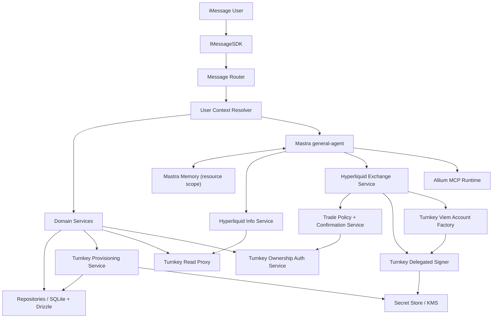
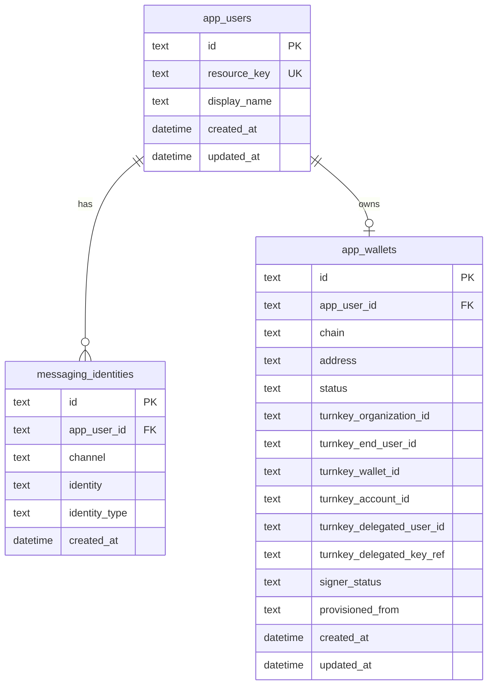
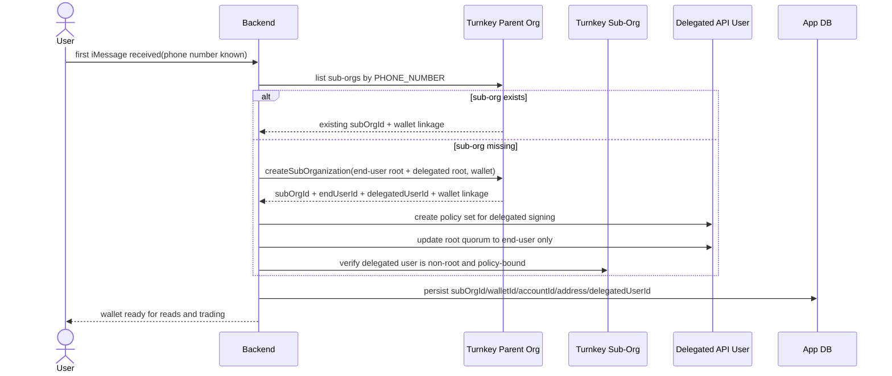
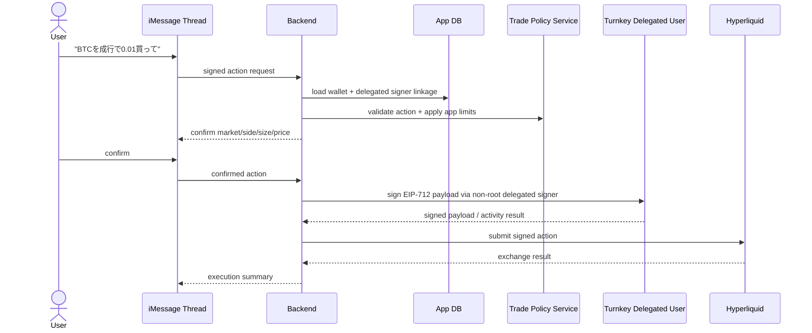

# Spec: Turnkey Wallet + Hyperliquid + Allium Agent Integration

**Version**: 1.5  
**Date**: 2026-03-23  
**Status**: Draft  
**Source Issue**: `posaune0423/imessage-financial-assistant#1`

## 1. Decision Summary

- Mastra agent は増やさず、**1つの `general-agent` を維持**する
- user interface は **iMessage only** とし、frontend は持たない
- multi-user 対応は `sender/chatId -> app user -> wallet context` を `agent.generate()` の前に解決する
- wallet は **phone number が確定した時点で backend が自動生成** する
- Turnkey の server-side 利用は `provisioning`, `read proxy`, `delegated signing`, `ownership auth` の 4 レーンに分ける
- wallet provisioning は Turnkey の **pre-generated wallet** パターンをベースに、phone number を canonical identity として server 側で固定する
- Turnkey query/read は **parent organization credential** を持つ backend が担い、read 用の end-user session は作らない
- Turnkey で作った wallet は `@turnkey/viem` の `createAccount()` で **viem account** に変換し、Hyperliquid SDK の署名ウォレットとして再利用する
- Hyperliquid は `InfoClient` と `ExchangeClient` の両方を扱い、read だけでなく **通常の signing / trading** も標準機能として設計する
- routine な Hyperliquid signing / trading は **server-managed delegated access signer** を標準ルートにする
- Turnkey の `session JWT` / `OTP login` は routine trade の主経路には使わず、**ownership verification / recovery / credential追加 / 高リスク操作** の補助経路として扱う
- Allium は built-in tool 化せず、**Mastra MCP toolset** として遅延ロードする
- wallet address や Turnkey linkage は working memory にも書けるが、**source of truth は app DB** に置く
- app-owned schema / query は Drizzle 管理に寄せ、repository 層の SQLite 実装は `src/di.ts` から注入する
- business logic は `src/domain`、Turnkey / Hyperliquid adapter は `src/lib` に分離する
- 実装はこの spec 承認後に開始し、それまでは **コード変更を行わない**

## 1.1 Implementation Guardrails

- proprietary data の schema 管理と read/write は Drizzle を使う
- repository 層にはまず SQLite 実装を用意し、その後に別 backend が必要になれば差し替える
- repository interface は `src/repositories/interfaces/` に置く
- DB type に依存する Drizzle schema は `src/repositories/sqlite/` 配下に置く
- app 固有の判断ロジック、state transition、routing rule は `src/domain` に置く
- Turnkey / Hyperliquid / Allium などの外部 SDK, API adapter は `src/lib` に閉じ込める
- frontend は作らず、OTP challenge / confirmation / order instruction はすべて iMessage 上で行う
- Turnkey `Auth Proxy` や iframe 前提の browser session は採用しない
- Turnkey policy enforcement を効かせる署名は **non-root signer** で実行し、root quorum では署名しない
- Turnkey secret material は app DB に保存せず、env / secret manager / KMS 管理を前提にする
- dependency wiring は `src/di.ts` に集約し、`src/main.ts` に constructor 群を持ち込まない
- `src/main.ts` は transport entrypoint と routing orchestration に徹し、domain rule を直接持たない
- agent tool は repository と adapter interface を呼ぶだけに留め、SDK constructor や SQL を直接持ち込まない

## 2. Why This Shape

Issue #1 の核は「single-user personal assistant を、wallet-aware な multi-user crypto agent に拡張する」ことにある。  
ただし現行コードにはすでに以下の良い土台がある。

- `src/main.ts` で request ごとに `requestContext` と `toolsets` を差し込める
- Mastra memory は `resource` scope で sender ごとに分離できる
- Allium MCP はすでに remote MCP として組み込みやすい

このため、agent を作り直したり、user ごとに agent instance を持ったりするのは不要。  
最小変更で伸ばすなら、**message loop の前段に user context 解決層を追加し、tools 側は request context から user-specific runtime を引く**のが最も素直。

## 3. Verified External Assumptions

### 3.1 Turnkey

- `createSubOrganization` は sub-organization 作成時に wallet/accounts を同時に初期化できる
- `createWallet` は `CURVE_SECP256K1` + `PATH_FORMAT_BIP32` + `ADDRESS_FORMAT_ETHEREUM` の account を作れる
- `@turnkey/viem` の `createAccount()` は `organizationId` と `signWith` から **viem custom account** を作れる
- `signWith` は address か account ID 系の識別子で指定できるため、DB には `accountId` と `address` の両方を保持する
- `list_verified_suborgs` / `list_suborgs` は `PHONE_NUMBER` filter を持つため、backend から phone number -> sub-org lookup ができる
- parent organization は sub-org data を query できるが、**sub-org 内部を直接 modify はできない**
- pre-generated wallet docs では、phone number が分かっていれば **phone number のみを持つ root user** の sub-org を作り、wallet を事前生成できる
- sessions docs では **parent organization が sub-org data を read できる** と明記されているため、read 用に end-user session を張る必要はない
- 同じ sessions docs では **session JWT 単体では Turnkey API request を stamp できず、session keypair が必要** と明記されている
- backend auth と auth proxy の docs は frontend から backend に JWT を渡す構図が中心であり、no-frontend の本サービスでは主経路にしづらい
- proxying signed requests docs では backend proxy が **validation / persistence / monitoring / broadcasting** に向くとされている
- delegated access overview では backend が **staking, redemptions, limit orders** のような action を server 側で実行できるとされている
- delegated access backend setup では server-only で DA user を bootstrap できるが、**quorum update 失敗時に DA user が root に残る危険** が明記されている
- root quorum docs と policy engine docs では **root quorum action は policy engine を bypass** する
- Turnkey cookbook では `@turnkey/viem` signer に **non-root user API key** を使うべきで、root user を使うと policy engine evaluation を bypass すると案内されている
- したがって no-frontend / iMessage-only の routine trading では、**root session ではなく non-root delegated signer + backend validation + Turnkey policy** が最も自然
- また parent org が sub-org を直接更新できないため、**delegated signer を後付けせず、sub-org creation 時点で一緒に bootstrap する** 方が筋が良い

### 3.2 Hyperliquid

- `@nktkas/hyperliquid` の `InfoClient` は market data, user state, open orders, fills などの **read-only query** を広くカバーする
- `ExchangeClient` は viem wallet を直接受け取れるため、Turnkey viem account をそのまま署名 wallet として利用できる
- WebSocket は market subscription に使えるが、P0 の iMessage UX では snapshot read の価値が高く、必須ではない
- SDK docs では `InfoClient({ transport })`, `ExchangeClient({ transport, wallet })`, `HttpTransport`, `WebSocketTransport` が分離されているため、app 側も read/write transport 境界を保った adapter 設計にする

### 3.3 Mastra

- 現行コードでも `requestContext` と per-request `toolsets` を agent 実行時に渡せる
- MCP は `MCPClient.listToolsetsWithErrors()` で server 単位に安全に toolset 化できる
- working memory は `resource` scope を維持できるため、sender 単位の会話記憶をそのまま使える

## 4. Scope

### Goals

- iMessage sender 単位で app user を解決する
- user が iMessage だけで wallet 作成・残高確認・署名・trade を完結できる
- app user に primary wallet context を紐づける
- Turnkey provisioning 情報を DB に永続化する
- Turnkey wallet を viem account 化し、Hyperliquid SDK の runtime に流し込める形にする
- agent が Hyperliquid market data / wallet-user data / Allium onchain query を自然言語から使える
- 既存の Mastra memory を app user 単位の stable resource key で継続利用する
- routine trade を frontend なしで実行できる Turnkey server-side path を定義する
- read / write / ownership auth の責務を混ぜずに設計する

### Non-Goals

- policy 制約なしの無制限 backend signing
- Web / mobile frontend 追加
- group chat の完全対応
- multi-process / queue / worker architecture
- third-party wallet import

## 5. Product Behavior

### First Contact

1. ユーザーが DM を送る
2. `sender` / `chatId` を messaging identity として app user を解決または作成する
3. wallet が未作成なら backend が **phone number を canonical key にして即時 provisioning** する
4. provisioning 完了後、primary EVM address を DB に保存し、working memory に同期する
5. signed action が必要なら backend は delegated signer の readiness を確認し、不足していれば server-side bootstrap を完了させる

### Turnkey Server Lanes

本サービスでは Turnkey の server-side 利用を 4 レーンに分ける。

1. **Provisioning lane**
   - first message 時の sub-org / wallet / signer bootstrap

2. **Read lane**
   - parent org credential による Turnkey query と local DB lookup

3. **Delegated signing lane**
   - non-root DA user credential による policy-enforced signing

4. **Ownership auth lane**
   - SMS OTP による end-user ownership verification
   - export / credential 追加 / recovery / privileged action でのみ使用

### Automatic Phone-Number Wallet Provisioning

今回の正規フローは、wallet creation と routine signing readiness を server 側で完結させる。

1. iMessage の送信元 phone number が確定する
2. backend がその phone number を canonical identity として app user を resolve/create する
3. backend が parent org で `PHONE_NUMBER` filter による sub-org lookup を行う
4. sub-org が無ければ、**end-user phone root user + delegated API user** を持つ sub-org を作る
5. sub-org 作成時に wallet/account を生成する
6. delegated API key で sub-org policy を作る
7. delegated API key で root quorum を end-user のみへ更新する
8. backend が post-condition を検証する
9. backend が `subOrgId / walletId / accountId / address / delegatedUserId` を app DB に保存する
10. 以後は同じ phone number に対して同じ wallet linkage を再利用する

補足:

- これは cryptographic deterministic wallet ではなく、**backend が phone number -> wallet linkage を決定的に再利用する** という意味である
- sub-org bootstrap 完了前は wallet status を `provisioning` のままにして signed action を開けない
- pre-generated wallet pattern の根本は **phone number を持つ end-user root user** である
- wallet existence 自体に SMS OTP は不要
- DA bootstrap は server-initiated なので、Turnkey docs の caution に従って **quorum update 成功確認が必須** である

### Ownership Authentication via SMS

SMS auth は routine trade の主経路ではなく、ownership を強く確認したい操作だけに使う。

1. user が wallet export, credential add, recovery, external withdraw などの高リスク操作を依頼する
2. backend が `INIT_OTP` を発行する
3. ユーザーは SMS で届いた OTP を iMessage に返信する
4. backend が `VERIFY_OTP` を実行して verification token を得る
5. 必要なら `OTP_LOGIN` で end-user session を得て ownership-sensitive action に使う
6. backend は Turnkey JWT claims を検証し、app user / sub-org と照合する

### Wallet / Crypto Questions

- 「自分の wallet」「残高」「ポジション」「open orders」「BTC の状況」などは local tool で解決する
- Hyperliquid account 参照は app user の primary EVM address を使う
- onchain 詳細分析は Allium MCP に委譲する

### Signed Hyperliquid Actions

- Turnkey viem account により Hyperliquid `ExchangeClient` へ進める設計にしておく
- wallet は自動生成しておき、routine signing / trading は **delegated signer** で利用可能にする
- 署名主体の正規ルートは **non-root delegated signing** にする
- SMS ownership auth は privileged action や recovery 系でのみ使う

### Signing Modes

将来の署名系アクションは 2 モードに分けて設計する。

1. **Delegated signing**
   - backend 管理の Delegated Access user を sub-org に作る
   - policy で allowed action を絞る
   - root quorum から Delegated user を外す
   - backend は restricted policy の範囲でのみ server-side signing を行う
   - Hyperliquid order / cancel / modify / leverage など routine trade はこのモードを使う

2. **Ownership-authenticated action**
   - user は SMS OTP を **iMessage で返信** して ownership を示す
   - backend は verification token / session JWT を検証し、app user と sub-org を照合する
   - export, authenticator 追加, recovery, external withdraw のような高リスク操作に使う

## 6. Architecture



## 7. Core Design: Mastra Integration

### 7.1 Keep One Agent Instance

`general-agent` は singleton のままにする。理由は以下。

- memory がすでに `resource` key で sender 分離できる
- built-in tools は request context を見れば user-aware にできる
- per-user agent instance を作ると lifecycle, memory, test complexity が無駄に増える

### 7.2 Resolve User Context Before `generate()`

`src/main.ts` は container を受け取った `handleDirectMessage()` を呼ぶだけにし、user-aware runtime 解決は handler 側で進める。

```ts
const app = await buildAppContainer();

sdk.startWatching({
  onDirectMessage: (message) => handleDirectMessage(message, app),
});

async function handleDirectMessage(message: IncomingMessage, app: AppContainer) {
  const incoming = normalizeIncomingMessage(message);
  const userContext = await app.userContextResolver.resolve(incoming);

  if (shouldProvisionWallet(incoming.text, userContext)) {
    await app.turnkeyProvisioning.ensurePrimaryWallet(userContext);
  }

  const freshUserContext = await app.userContextResolver.resolve(incoming);

  const requestContext = createAgentRequestContext({
    sender: incoming.sender,
    chatId: incoming.chatId,
    ownerPhone: app.config.ownerPhone,
    appUserId: freshUserContext.id,
    resourceKey: freshUserContext.resourceKey,
    walletAddress: freshUserContext.wallet?.address,
    walletStatus: freshUserContext.wallet?.status,
    signerStatus: freshUserContext.wallet?.signerStatus,
    turnkeyOrganizationId: freshUserContext.wallet?.organizationId,
    turnkeyWalletId: freshUserContext.wallet?.walletId,
    turnkeyAccountId: freshUserContext.wallet?.accountId,
    turnkeyDelegatedUserId: freshUserContext.wallet?.delegatedUserId,
  });

  const toolsets = shouldResolveAlliumToolsets(incoming.text) ? await app.mcpRuntime.getToolsets() : undefined;

  return app.agent.generate(incoming.text, {
    memory: {
      resource: freshUserContext.resourceKey,
      thread: "default",
    },
    requestContext,
    toolsets,
    maxSteps: app.config.agent.maxSteps,
  });
}
```

意図:

- `main.ts` は `buildAppContainer()` と watcher 起動だけを持つ
- message ごとの domain 解決は handler へ閉じ込める
- provisioning 後に user context を再読込して request context を stale にしない

### 7.3 Tool Partitioning

tools は 3 層に分ける。

1. **Always-on local tools**
   - iMessage
   - scheduling / reminder
   - web search

2. **Always-registered crypto tools**
   - wallet tools
   - Hyperliquid read tools
   - 将来の signed Hyperliquid tools

3. **Dynamically loaded MCP tools**
   - Allium

重要なのは、**wallet/hyperliquid tools を per-user dynamic registration しない**こと。  
tool 自体は static に登録し、実行時に `requestContext.appUserId` をキーに DB と service layer から runtime を解決する。

tool から SDK client を直接 new しない。  
Hyperliquid は `src/lib/hyperliquid` の factory / interface を経由し、read は `InfoClient + transport`、将来の signed write は `ExchangeClient + wallet` に閉じ込める。

この形なら、Mastra agent を再構築せずに user-aware な crypto behavior を実現できる。

### 7.4 Entrypoint Rule

`src/main.ts` は以下のみを担当する。

- `buildAppContainer()` を 1 回呼ぶ
- iMessage watcher / heartbeat / shutdown hook を起動する
- transport event を handler に委譲する

逆に、以下は `main.ts` に置かない。

- incoming message ごとの domain 解決
- app user の永続化ロジック
- wallet lifecycle の state transition
- Turnkey / Hyperliquid SDK の初期化詳細
- SQL / schema knowledge
- repository / adapter / service の配線

### 7.5 Composition Root via `src/di.ts`

`src/di.ts` を composition root として追加する。

責務:

- env / config を読む
- SQLite client と Drizzle repository 実装を組み立てる
- Turnkey / Hyperliquid / Allium adapter を生成する
- domain service と agent runtime dependency を束ねる
- `main.ts` へ app container を返す

`main.ts` は `buildAppContainer()` のような factory を呼ぶだけにして、message loop に必要な dependency を受け取る。

```ts
const app = await buildAppContainer();

sdk.startWatching({
  onDirectMessage: (message) => handleDirectMessage(message, app),
});
```

この分離で得たいこと:

- `main.ts` を transport entrypoint のまま小さく保つ
- repository 実装差し替えを `di.ts` に閉じ込める
- test 用の fake container を作りやすくする
- constructor 追加で `main.ts` が崩れるのを防ぐ

`AppContainer` の最小イメージ:

```ts
interface AppContainer {
  config: AppConfig;
  agent: GeneralAgent;
  mcpRuntime: McpRuntime;
  userContextResolver: UserContextResolver;
  turnkeyProvisioning: TurnkeyProvisioningService;
  hyperliquidService: HyperliquidService;
}
```

### 7.6 Request Context Is the Runtime Bridge

`src/agents/request-context.ts` は以下を保持できるよう拡張する。

```ts
interface AgentRequestContextValues {
  sender?: string;
  chatId?: string;
  ownerPhone?: string;
  isHeartbeat?: boolean;
  appUserId?: string;
  resourceKey?: string;
  walletAddress?: `0x${string}`;
  walletStatus?: "none" | "provisioning" | "ready" | "failed";
  signerStatus?: "not_bootstrapped" | "bootstrapping" | "ready" | "degraded";
  turnkeyOrganizationId?: string;
  turnkeyWalletId?: string;
  turnkeyAccountId?: string;
  turnkeyDelegatedUserId?: string;
}
```

これにより tool は env を直読む必要がなくなり、`requestContext` だけで user runtime へ到達できる。

### 7.7 Source of Truth

- **DB**: user / wallet / Turnkey linkage / status
- **Mastra working memory**: conversational hints と wallet existence の軽いメモ
- **tool execution result**: balances, positions, orders の真値

LLM が wallet address や残高を working memory から推測するのを避けるため、prompt では「wallet/account facts は必ず tool で確認する」と明記する。

## 8. Agent Behavior Design

### 8.1 System Prompt Additions

`src/agents/SOUL.md` に以下を追加する。

- wallet address, balances, orders, positions は推測せず tool で確認する
- ユーザー自身の wallet 情報は `wallet_*` / `hyperliquid_*` tool を優先する
- onchain detail は Allium MCP を優先し、SQL や schema は必要最小限にする
- iMessage 返信は短く、数字は単位付き、可能なら取得時刻を含める
- signed action の実行時は、対象市場、side、size、price、tif、reduce-only の有無を明示して短く確認する

### 8.2 Wallet Lifecycle States

```text
none -> provisioning -> ready
none -> provisioning -> failed
failed -> provisioning -> ready
```

agent 側では以下の表現ルールを持つ。

- `none`: 「wallet 未作成」
- `provisioning`: 「作成中なので少し待ってください」
- `ready`: address を tool で返せる
- `failed`: 再試行または admin fallback を案内

signer state は wallet state と分けて扱う。

```text
not_bootstrapped -> bootstrapping -> ready
ready -> degraded
degraded -> bootstrapping -> ready
```

agent は iMessage-only UX を前提に、signing readiness や order confirmation を短い会話で完結させる。

- signer bootstrap 中は「取引用 signer を準備しています」と返す
- order 実行前は対象 market, side, size, price を 1 メッセージで確認する
- ownership auth が必要な高リスク操作だけ OTP を要求する

### 8.3 Signed Action Strategy

signed action を入れる場合も、agent 設計は別 agent ではなく **same agent + standard tools** を採る。

- read tools と write tools は同じ agent に登録する
- write 実行時は active delegated signer を必須にする
- server は signer readiness と app-user / sub-org / delegated-user の対応を検証する
- policy で禁じたい操作は Turnkey 側で拒否できるようにする

この repo では、Hyperliquid trading は通常機能として扱う。  
したがって「feature flag が有効なユーザーだけ公開」という前提は置かない。

## 9. Data Model

P0 の proprietary data model は最小限に絞る。  
sender/chatId を `app_users` に直持ちせず、`messaging_identities` へ分離する。



### Notes

- `resource_key` は Mastra memory の `resource` と一致させる
- `turnkey_account_id` と `address` の両方を保存し、`signWith` の実装自由度を残す
- `messaging_identities(channel, identity)` は unique 制約を持つ
- wallet は P0 では 1 user 1 primary wallet 前提だが、table 名は `app_wallets` にして将来拡張を阻害しない
- `turnkey_delegated_user_id` は routine signing を担う non-root signer の linkage を表す
- `turnkey_delegated_key_ref` は private key そのものではなく、secret manager 側の参照子を保持する
- `signer_status` は `not_bootstrapped | bootstrapping | ready | degraded` を表す
- `provisioned_from` は `phone_number_first_message` のような provenance 記録に使える
- parent org private key と delegated signer private key はこの app DB には保存しない
- secret material は env / secret manager / KMS で扱い、DB には linkage metadata だけを置く

## 10. Service Layer

### 10.1 User Context Resolver

`src/domain/users/user-context.ts`

責務:

- incoming message から messaging identity を抽出する
- repository 経由で `app_users` と `messaging_identities` を lookup / create する
- wallet linkage を join して `UserContext` を返す
- Mastra 用の stable `resourceKey` を返す

```ts
interface UserContext {
  id: string;
  resourceKey: string;
  sender: string;
  chatId?: string;
  displayName?: string;
  wallet: {
    status: "none" | "provisioning" | "ready" | "failed";
    signerStatus?: "not_bootstrapped" | "bootstrapping" | "ready" | "degraded";
    organizationId?: string;
    endUserId?: string;
    walletId?: string;
    accountId?: string;
    delegatedUserId?: string;
    address?: `0x${string}`;
  } | null;
}
```

### 10.2 Turnkey Provisioning Service

`src/lib/turnkey/provisioning.ts`

責務:

- sub-organization 作成
- primary wallet / primary account 作成
- delegated signer bootstrap
- local DB 更新
- idempotent retry

設計ルール:

- provisioning は user context service 経由でのみ呼ぶ
- `wallet_status=provisioning` を先に保存して二重実行を防ぐ
- secret material は一切保存しない
- phone number 確定時は以下を実行する:
  - `PHONE_NUMBER` で sub-org lookup
  - not found なら end-user root user と delegated API user を含む sub-org create
  - wallet/account create または sub-org creation 時に同時生成
  - delegated API key で policy create
  - delegated API key で root quorum を end-user only に更新
  - quorum / policy / signer usability を検証
  - linkage metadata を app DB に保存

### 10.3 Server-side Wallet Generation Flow

`src/lib/turnkey/provisioning.ts` で backend が担う具体的な流れ:



```text
first iMessage received(phone number known)
  -> backend lookup sub-org by PHONE_NUMBER
  -> if missing: create sub-org with end-user root user and delegated API user
  -> create wallet/account as part of sub-org creation
  -> create delegated signer policies
  -> remove delegated user from root quorum
  -> verify delegated signer is non-root and usable
  -> persist subOrgId / walletId / accountId / address / delegatedUserId in app DB
  -> future requests reuse the same linkage
```

設計ルール:

- parent org credential は backend のみが保持する
- delegated signer private key は backend secret store のみが保持する
- backend が app DB に保存するのは Turnkey linkage metadata のみ
- signup/login 共通で phone number を canonical key として扱う
- quorum update / policy create / signer usability のいずれかが失敗した場合、`signer_status=degraded` として read-only 扱いに落とす

### 10.4 Delegated Signing Flow

routine な Hyperliquid signed action の正規フロー:



### 10.5 Ownership Authentication Flow

ownership-sensitive action の補助フロー:

1. user が iMessage で wallet export / credential add / recovery / external withdraw を依頼する
2. backend は `INIT_OTP` を parent org で発行する
3. user は SMS で受け取った code を iMessage に返信する
4. backend は `VERIFY_OTP` を実行して verification token を得る
5. 必要なら `OTP_LOGIN` を sub-org に対して実行する
6. backend は `verifySessionJwtSignature` で JWT 署名を検証する
7. backend は `organization_id`, `user_id`, `exp` を確認する
8. backend は app DB の `app_user -> turnkey_sub_org_id / turnkey_end_user_id` と照合する
9. 一致した場合のみ ownership-sensitive action を開放する

重要:

- sessions docs 上、session JWT 単体では request を stamp できない
- したがって OTP session を routine Hyperliquid trade の標準署名経路にはしない
- backend authentication docs 上、JWT claims 検証は ownership check や app-level authorization に使う
- proxying signed requests docs 上、backend proxy は monitoring / validation / persistence に向く

### 10.6 Turnkey Viem Account Factory

`src/lib/turnkey/viem.ts`

責務:

- non-root delegated credentials で `TurnkeyClient` を初期化
- `createAccount()` で viem account を返す
- `organizationId` は user sub-org
- `signWith` は `turnkey_account_id` を優先し、必要なら address fallback

```ts
const account = await createAccount({
  client: turnkeyClient,
  organizationId: wallet.organizationId,
  signWith: wallet.accountId ?? wallet.address,
  ethereumAddress: wallet.address,
});
```

これは Turnkey-backed signer を viem / Hyperliquid runtime に橋渡しする adapter として扱う。  
policy evaluation を効かせるため、root credential は使わない。

### 10.7 Delegated Access Bootstrap Guarantees

server-side delegated access を標準ルートにする代わりに、以下を bootstrap 完了条件にする。

1. backend が sub-org 作成時に end-user に加えて Delegated Access user を作る
2. backend が delegated credential で policy を作成できることを確認する
3. backend が root quorum から Delegated user を外す
4. backend が post-bootstrap query で root quorum と policy attachment を確認する
5. backend が small no-op もしくは dry-run 相当の署名疎通確認を行う
6. すべて通った場合だけ `signer_status=ready` にする

この bootstrap は Turnkey docs 上の caution があるため、成功確認なしに `ready` へ進めない。

### 10.8 Hyperliquid Services

`src/lib/hyperliquid/service.ts`

read path:

- singleton `InfoClient`
- transport は `HttpTransport` を基本とし、subscription 導入時だけ `WebSocketTransport` を別途追加する
- `allMids()`
- `meta()` と必要な info method
- `userState({ user })`
- `frontendOpenOrders({ user })` または `openOrders({ user })`
- `openOrders({ user })`
- `userFills({ user })`

write path:

- `createExchangeClient(userContext)`
- wallet runtime が無い場合は失敗
- `signatureChainId` は config で明示指定できるようにする
- `ExchangeClient` は read path と別 factory にして、read tool から誤って signed runtime に触れないようにする
- standard signed methods は `order`, `cancel`, `modify`, `updateLeverage`, `usdSend`, `withdraw3` などを対象にする
- signed runtime は delegated signer `ready` 時のみ生成する
- Hyperliquid action の payload 検証は SDK 呼び出し前に app 側でも行う

### 10.9 Repository Layer

`src/repositories/`

責務:

- domain から見える interface を定義する
- proprietary data access を Drizzle query に閉じ込める
- P0 では SQLite 実装を用意する
- interface は DB 非依存に保つ
- schema は SQLite 実装の詳細として扱う

最小構成:

- `interfaces/app-user-repository.ts`
- `interfaces/wallet-repository.ts`
- `sqlite/schema.ts`
- `sqlite/client.ts`
- `sqlite/sqlite-app-user-repository.ts`
- `sqlite/sqlite-wallet-repository.ts`

配置ルール:

- `src/repositories/interfaces/`:
  - domain/use-case が依存する repository interface を置く
  - SQLite や Drizzle の型を漏らさない

- `src/repositories/sqlite/`:
  - SQLite client 初期化
  - Drizzle schema
  - SQLite repository implementation

- `src/lib/`:
  - Turnkey / Hyperliquid / Allium など外部 SDK adapter だけを置く
  - app-owned DB schema は置かない

`secret store`:

- repository 層とは別物として扱う
- parent org private key, delegated signer private key, key reference metadata を扱う
- SQLite 永続テーブルには秘密鍵を落とさない

## 11. Tool Design

### P0 Tools

#### `wallet_get_profile`

- 入力: なし
- 出力: wallet status, primary address, createdAt
- 使いどころ: 「自分の wallet」「アドレス教えて」

#### `wallet_ensure_primary`

- 入力: `force?: boolean`
- 出力: status, address
- 使いどころ: 明示的な wallet 作成依頼
- router から自動実行するケースがあるので、tool 自体は idempotent にする

#### `hyperliquid_get_market_snapshot`

- 入力: `coins?: string[]`
- 出力: mids, key metrics, timestamp
- 実装: `InfoClient.allMids()` + metadata を整形

#### `hyperliquid_get_user_summary`

- 入力: `address?: 0x...`
- 出力: margin summary, positions, withdrawable, spot balances
- デフォルトは current user の primary wallet

#### `hyperliquid_get_open_orders`

- 入力: `address?: 0x...`
- 出力: open orders

#### `hyperliquid_get_recent_fills`

- 入力: `address?: 0x...`, `limit?: number`
- 出力: recent fills

#### `hyperliquid_place_order`

- 入力: market, side, size, price, tif, reduceOnly
- 出力: order result, oid / cloid, status
- 実装: `ExchangeClient.order()`
- 署名経路: delegated signing
- 実行前に 1 メッセージ確認を必須にする

#### `hyperliquid_cancel_orders`

- 入力: oid または cloid, market
- 出力: cancel result
- 実装: `ExchangeClient.cancel()` または `cancelByCloid()`
- 署名経路: delegated signing

#### `hyperliquid_modify_order`

- 入力: oid, new price/size/tif
- 出力: modify result
- 実装: `ExchangeClient.modify()`
- 署名経路: delegated signing

#### `hyperliquid_update_leverage`

- 入力: market, leverage, isolated/cross
- 出力: leverage update result
- 実装: `ExchangeClient.updateLeverage()`
- 署名経路: delegated signing

#### `hyperliquid_transfer_usd`

- 入力: destination, amount
- 出力: transfer result
- 実装: `ExchangeClient.usdSend()` など対応 method
- 署名経路: delegated signing
- 宛先制約は Turnkey policy と app validation の両方で持つ

#### `hyperliquid_withdraw`

- 入力: destination, amount
- 出力: withdraw result
- 実装: `ExchangeClient.withdraw3()`
- 署名経路: ownership-authenticated action
- delegated signing のみで即時解放しない

signed action の原則:

- default は delegated signing
- external value exit は ownership-authenticated action に寄せる
- どちらの mode でも backend で app-user / sub-org / policy 対応を検証する

## 12. Allium Integration

Allium は local tool にせず、現行 `createMcpRuntime()` を拡張して扱う。

方針:

- `ALLIUM_API_KEY` があれば server を自動追加
- crypto / onchain intent のときだけ `mcp.getToolsets()` を呼ぶ
- agent prompt では「まず local wallet/hyperliquid tool、足りない場合だけ Allium」を明示する

理由:

- wallet/user state は local tool の方が deterministic
- Allium は schema search や onchain deep-dive に向く
- iMessage では不要な MCP 接続を毎回行わない方が応答が安定する

## 13. Config Additions

`src/env.ts` / `src/config.ts` に以下を追加する。

```bash
TURNKEY_API_BASE_URL=https://api.turnkey.com
TURNKEY_API_PUBLIC_KEY=
TURNKEY_API_PRIVATE_KEY=
TURNKEY_ORGANIZATION_ID=
TURNKEY_DELEGATED_KEY_SECRET_NAMESPACE=

HYPERLIQUID_API_URL=https://api.hyperliquid.xyz
HYPERLIQUID_WS_URL=wss://api.hyperliquid.xyz/ws
HYPERLIQUID_SIGNATURE_CHAIN_ID=

ALLIUM_API_KEY=
MULTI_USER_MODE=true
```

## 14. Proposed File Changes

```text
src/
├── di.ts
├── agents/
│   ├── tools/
│   │   ├── wallet.ts
│   │   └── hyperliquid.ts
│   └── request-context.ts
├── domain/
│   └── users/
│       ├── types.ts
│       └── user-context.ts
├── lib/
│   ├── turnkey/
│   │   ├── interfaces.ts
│   │   ├── provisioning.ts
│   │   ├── delegated-signer.ts
│   │   ├── ownership-auth.ts
│   │   └── viem.ts
│   └── hyperliquid/
│       ├── interfaces.ts
│       └── service.ts
├── repositories/
│   ├── interfaces/
│   │   ├── app-user-repository.ts
│   │   └── wallet-repository.ts
│   └── sqlite/
│       ├── client.ts
│       ├── schema.ts
│       ├── sqlite-app-user-repository.ts
│       └── sqlite-wallet-repository.ts
├── config.ts
├── env.ts
└── main.ts
```

## 15. Implementation Sequence

この spec 承認までは **docs のみ更新** し、実装は始めない。

### Phase 1

- `src/di.ts` と app container 形状の確定
- SQLite schema 確定
- `src/repositories/interfaces/` の interface 定義
- `src/repositories/sqlite/` の Drizzle schema と SQLite 実装
- `UserContextResolver`
- e2e routing spec の明文化

### Phase 2

- automatic phone-number wallet provisioning
- delegated signer bootstrap
- wallet repository
- `wallet_get_profile`
- provisioning idempotency tests

### Phase 3

- Hyperliquid read service
- market/user tools
- signed trading tools
- trade confirmation / policy validation flow
- prompt update
- integration tests

### Phase 4

- ownership auth flow for high-risk actions
- Allium MCP usage guidance
- toolset resolution refinement
- compact iMessage answer formatting

### Phase 5

- Turnkey viem runtime hardening
- Hyperliquid advanced action coverage
- delegated signer observability and policy evaluation introspection

## 16. Testing Plan

- unit: user context resolution, provisioning state transitions, delegated signer state transitions, request-context fields
- integration: `buildAppContainer()` wiring, wallet provisioning workflow, delegated signer bootstrap, Hyperliquid read tool formatting, Allium toolset resolution
- e2e: different senders get isolated app user/resource keys and replies
- contract-style mocks: Turnkey and Hyperliquid SDK wrappers
- regression: heartbeat still uses owner scope and is not broken by multi-user routing
- security regression: delegated signer must not remain in root quorum after bootstrap
- observability: failed policy evaluation and failed quorum update are surfaced as degraded signer state

## 17. Risks

1. **Provisioning latency**
   First wallet creation can happen on the first message. Router で進捗返信を出す設計が必要。

2. **Identity strength**
   iMessage sender を wallet owner と見なすのは read-only なら妥当だが、write action では弱い。routine trade は delegated signer と app confirmation で補い、high-risk action は ownership auth を要求する。

3. **Delegated access bootstrap risk**
   Turnkey docs が警告している通り、server-side bootstrap で quorum update が失敗すると delegated user が root に残る。post-condition 検証と degraded state へのフォールバックが必須。

4. **Action safety**
   Hyperliquid signed action を通常機能にするなら、prompt と tool input validation が甘いと誤発注リスクがある。

5. **Working memory drift**
   wallet facts を memory に書きすぎると stale になる。真値は DB/tool へ固定する。

6. **Policy expressiveness**
   Hyperliquid action を Turnkey policy にどこまで落とせるかは typed data shape に依存する。app validation だけに寄りすぎると Turnkey 側の hard guard が弱くなる。

7. **Root bypass confusion**
   root credential で `@turnkey/viem` signer を作ると policy engine を bypass する。non-root delegated signer と root / parent credential の使い分けを誤ると危険。

8. **Ownership auth UX**
   frontend が無いので OTP reply は iMessage thread 上で行う。deliverability や rate limit の影響は残る。

## 18. Acceptance Criteria

- sender/chatId ごとに独立した app user と Mastra memory resource が解決される
- user が iMessage だけで wallet 作成・signing/trading を完結できる
- wallet 未作成ユーザーに対して provisioning path が存在する
- Turnkey linkage を viem account runtime に変換できる設計になっている
- first message で phone number が確定した時点で sub-org lookup/create と wallet generation を行う server flow が定義されている
- 同じ phone number に対して同じ wallet linkage を再利用する server rule が定義されている
- delegated signer bootstrap, quorum update, policy verification の server flow が定義されている
- delegated signing が標準 trading ルートとして定義されている
- root quorum action と policy-enforced non-root signing の境界が定義されている
- frontend なしで OTP challenge-response を iMessage thread だけで完結する ownership auth flow が定義されている
- agent が Hyperliquid market snapshot と user summary を返せる設計になっている
- agent が Hyperliquid の標準的な signing / trading action を扱える設計になっている
- agent が必要時のみ Allium MCP を使う設計になっている
- signed action が通常機能として位置づけられつつ、backend validation と Turnkey policy で境界づけられている
- proprietary data access が Drizzle + repository 経由に統一される
- repository interface が `src/repositories/interfaces/` に集約される
- DB type 依存の schema が `src/repositories/sqlite/schema.ts` に閉じる
- `src/main.ts` は app container を起動して handler へ委譲するだけに留まる
- `src/di.ts` が dependency wiring を担当し、`src/main.ts` が orchestration のみを担当し、domain rule と SDK detail を持たない

## 19. References

- Turnkey API `createSubOrganization`: https://docs.turnkey.com/api-reference/activities/create-sub-organization
- Turnkey API `createWallet`: https://docs.turnkey.com/api-reference/activities/create-wallet
- Turnkey `@turnkey/viem`: https://github.com/tkhq/sdk/tree/main/packages/viem
- Turnkey sessions: https://docs.turnkey.com/authentication/sessions
- Turnkey SMS auth: https://docs.turnkey.com/authentication/sms
- Turnkey backend auth: https://docs.turnkey.com/authentication/backend-setup
- Turnkey proxying signed requests: https://docs.turnkey.com/authentication/proxying-signed-requests
- Turnkey auth proxy: https://docs.turnkey.com/reference/auth-proxy
- Turnkey pre-generated wallets: https://docs.turnkey.com/wallets/pregenerated-wallets
- Turnkey verified sub-org lookup: https://docs.turnkey.com/api-reference/queries/get-verified-sub-organizations
- Turnkey delegated access overview: https://docs.turnkey.com/concepts/policies/delegated-access-overview
- Turnkey server-side delegated access: https://docs.turnkey.com/concepts/policies/delegated-access-backend
- Turnkey root quorum: https://docs.turnkey.com/concepts/users/root-quorum
- Turnkey cookbook (non-root signer guidance): https://docs.turnkey.com/cookbook/morpho
- Turnkey Ethereum support / EIP-712: https://docs.turnkey.com/networks/ethereum
- Hyperliquid API docs: https://hyperliquid.gitbook.io/hyperliquid-docs/for-developers/api
- Hyperliquid SDK docs: https://nktkas.gitbook.io/hyperliquid
- Hyperliquid TypeScript SDK: https://github.com/nktkas/hyperliquid
- Current Allium MCP server wiring: `src/agents/mcp/allium.ts`
- Current message loop entrypoint: `src/main.ts`
